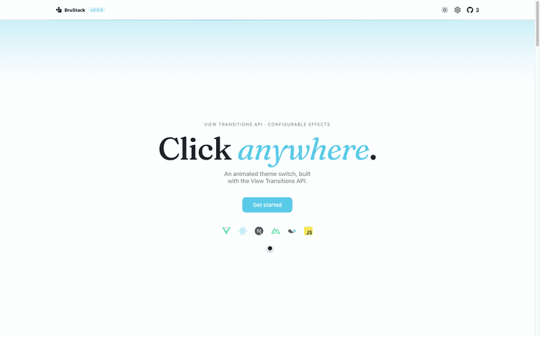

# @brustack/theme-transitions-core

[](https://github.com/brustack)
[](https://www.npmjs.com/package/@brustack/theme-transitions-core)
[](https://github.com/brustack/theme-transitions/blob/main/packages/core/LICENSE)

Framework-agnostic core for animated theme transitions using the View Transitions API.

- ✅ Multiple effects to choose from
- ✅ Zero flash of the wrong theme on load
- ✅ Syncs automatically with OS `prefers-color-scheme`
- ✅ Custom themes beyond light/dark
- ✅ Vite plugin included, any other bundler supported via two exported functions
- ✅ Framework-agnostic, thin adapters for Vue, React, Nuxt, and Next.js

<br>

<p align="center">
  
</p>

<p align="center">Check out the <a href="https://theme-transitions.brustack.dev">Live Example</a> to try it for yourself.</p>

## Install

```sh
npm install @brustack/theme-transitions-core
# or
pnpm add @brustack/theme-transitions-core
# or
yarn add @brustack/theme-transitions-core
```

## Usage

```ts
// main.ts (wherever your app initializes)
import "@brustack/theme-transitions-core/style.css";
import { getController } from "@brustack/theme-transitions-core";

const controller = getController();
const button = document.querySelector<HTMLButtonElement>("#theme-toggle")!;

button.addEventListener("click", () => {
  controller.toggleTheme();
});

controller.subscribe(() => {
  const { theme, isAnimating } = controller.getState();
  button.textContent = theme;
  button.disabled = isAnimating;
});
```

This wires up the interactive toggle. It doesn't yet prevent a flash of the wrong theme on load, that's what the Vite plugin (or Other bundlers) section below sets up.

## Styling

The controller applies the current theme's name (`dark`, `light`, or a custom name, see Custom themes below) as a class on `<html>`. Style your palette off that class with any approach.

### CSS variables

```css
:root {
  --bg: #ffffff;
  --text: #111111;
}

html.dark {
  --bg: #0b0b10;
  --text: #f4f2ed;
}

html.sepia {
  --bg: #f4ecd8;
  --text: #4b3621;
}

body {
  background: var(--bg);
  color: var(--text);
}
```

### Tailwind

Set `darkMode: 'class'` in your Tailwind config (see Install above), then map your color tokens to the CSS variables above:

```js
// tailwind.config.js
module.exports = {
  darkMode: "class",
  theme: {
    extend: {
      colors: {
        bg: "var(--bg)",
        text: "var(--text)",
      },
    },
  },
};
```

## Configuration (optional)

| Variant          | `duration` |             `easing`             | `direction` |
| ---------------- | :--------: | :------------------------------: | :---------: |
| `spread`         |   `'1s'`   |                ❌                |     ❌      |
| `fade` (default) | `'400ms'`  |             `'ease'`             |     ❌      |
| `wipe`           |  `'1s'`    |           `'ease-out'`           |  `'left'`   |
| `none`           |     ❌     |                ❌                |     ❌      |

```ts
getController({ variant: "spread", duration: "1s" });
```

The first call in a process sets the shared default; `createController(options)` creates an independent instance instead. `toggleTheme`/`setTheme` accept a `TransitionOptions` object (same shape, plus `origin`, required for `spread`, derive it with `originFromEvent(event)` or `originFromElement(el)`) to override just that one call.

### Custom themes

Register extra theme names beyond `light`/`dark`/`system` via `themes`:

```ts
getController({ themes: ["sepia", "sunset"] });
```

`setTheme('sepia')` then applies a `sepia` class the same way `light`/`dark` do (see Styling above). `controller.getState().themes` always includes `['light', 'dark', 'system', ...your custom names]`, useful for building a theme switcher. `toggleTheme()` is unaffected, it always flips between `light` and `dark`.

## API

|                                       |                                                                                                                  |
| ------------------------------------- | ---------------------------------------------------------------------------------------------------------------- |
| `getController(options?)`             | Returns the shared controller singleton                                                                          |
| `createController(options?)`          | Returns an independent, non-singleton controller                                                                 |
| `resetController()`                   | Clears the shared singleton so the next `getController()` call creates a fresh one. Mainly useful between tests. |
| `controller.toggleTheme(options?)`    | Switch between light and dark                                                                                    |
| `controller.setTheme(mode, options?)` | Set `light`, `dark`, `system`, or a custom theme name                                                            |
| `controller.getState()`               | Returns `{ theme, mode, isAnimating, themes }`                                                                   |
| `controller.subscribe(listener)`      | Runs `listener` on every state change, returns an unsubscribe function                                           |
| `originFromEvent(event)`              | Click position for spread                                                                                        |
| `originFromElement(el)`               | Element center for spread                                                                                        |

## Advanced

Lower-level exports the six official adapters are themselves built on. Reach for these if you're building a custom framework integration or wrapping the controller yourself.

|                                                                |                                                                                                                                                                                                                                                                         |
| -------------------------------------------------------------- | ----------------------------------------------------------------------------------------------------------------------------------------------------------------------------------------------------------------------------------------------------------------------- |
| `resolveOptions(eventOrOpts)`                                  | Normalizes a `MouseEvent` or `TransitionOptions` into `TransitionOptions`, deriving `origin` from the event. What every adapter's `toggleTheme`/`setTheme` calls under the hood.                                                                                        |
| `resolveThemeEffects(options?)`                                | Merges variant overrides into a full per-effect option set (`{ spread, fade, wipe, none }`).                                                                                                                                                                            |
| `defaultThemeEffects`                                          | The built-in default option set for every effect.                                                                                                                                                                                                                       |
| `DEFAULT_VARIANT`                                              | The default transition variant (`'fade'`).                                                                                                                                                                                                                              |
| `buildThemeTransitionCss(effects?)`                            | Generates the `::view-transition-*` CSS for a given effect set. What the Vite plugin and Nuxt module inject.                                                                                                                                                            |
| `buildConfigInitScript(options)`                               | Generates the script that sets `window.__themeConfig`, so every `getController()` call in the app picks up the same default effect options without repeating them. Prepend it to `buildColorModeInitScript()`'s output for non-Vite bundlers, see Other bundlers below. |
| `applyThemeClass(value, previous?)`                            | Swaps the theme class on `<html>`.                                                                                                                                                                                                                                      |
| `getSystemTheme()`                                             | Reads the OS `prefers-color-scheme`.                                                                                                                                                                                                                                    |
| `resolveTheme(preference)`                                     | Resolves `'system'` to `'light'`/`'dark'`, passes any other value through unchanged.                                                                                                                                                                                    |
| `readStoredPreference()` / `writeStoredPreference(preference)` | Read/write the persisted theme preference.                                                                                                                                                                                                                              |
| `isValidCssDuration(duration)` / `parseCssDuration(duration)`  | Validate/parse a CSS duration string like `'400ms'`.                                                                                                                                                                                                                    |

## Vite plugin

Register the anti-flash init script in `vite.config.ts`:

```ts
import { defineConfig } from "vite";
import { themeTransitions } from "@brustack/theme-transitions-core/vite";

export default defineConfig({
  plugins: [themeTransitions()],
});
```

Optionally, pass default effect options so every `getController()` call in the app picks them up without repeating them:

```ts
plugins: [themeTransitions({ variant: 'spread', duration: '1s' })],
```

## Other bundlers

Not using Vite? The plugin above is a thin wrapper around two functions this package already exports, so you can get the same anti-flash behavior with any bundler by calling them directly.

With webpack and `html-webpack-plugin`:

```js
const {
  buildColorModeInitScript,
} = require("@brustack/theme-transitions-core");

new HtmlWebpackPlugin({
  templateParameters: { themeInitScript: buildColorModeInitScript() },
});
```

```html
<!-- in the HTML template, inside <head> -->
<script>
  <%= htmlWebpackPlugin.options.templateParameters.themeInitScript %>
</script>
```

The script must run in `<head>`, before the page paints, regardless of where your bundle's own `<script>` tags are injected. To also set app-wide default effect options (the same thing the Vite plugin's argument does), prepend `buildConfigInitScript(options)` (which sets `window.__themeConfig`) to the same string.

For zero-build/CDN consumers who can't call `buildColorModeInitScript()` themselves, this package also ships `dist/theme-init.js`, a prebuilt, static copy of the same anti-flash init script. Load it directly with a `<script src="...theme-init.js"></script>` tag in `<head>`.

Webpack also needs a CSS rule that reaches into `node_modules` for this package's stylesheet. If your existing `.css` rule excludes `node_modules` (common when scoping CSS Modules to your own source), add this package's path to that rule's `include`:

```js
{
  test: /\.css$/,
  include: [path.resolve(__dirname, 'node_modules/@brustack/theme-transitions-core')],
  use: ['style-loader', 'css-loader'],
}
```

## Notes

- Server-side code (SSR) must use `createController()` for a request-scoped instance. `getController()`'s shared singleton is safe only for client-side usage, where one browser tab is already its own isolated process. A Node server handles many requests in the same process, so sharing the singleton there risks one user's theme leaking into another's response.

## Known issues

- Chrome 150 has a regression where the `spread` effect's clip-path animation can render from the wrong position after the browser window moves between displays with different DPI/scaling. This is a Chrome bug, not something this package can work around. It's already fixed upstream and verified in Chrome Canary; the fix should reach the Stable channel in a future release. See [Chromium issue #535696703](https://issues.chromium.org/issues/535696703).
